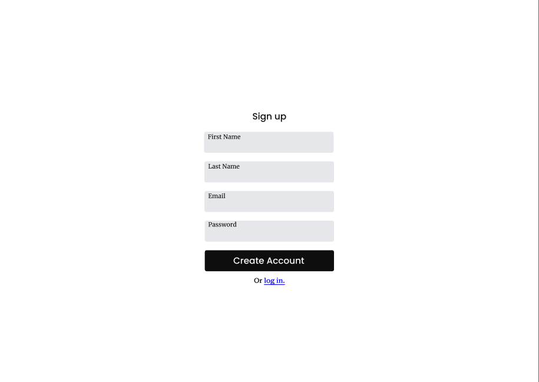
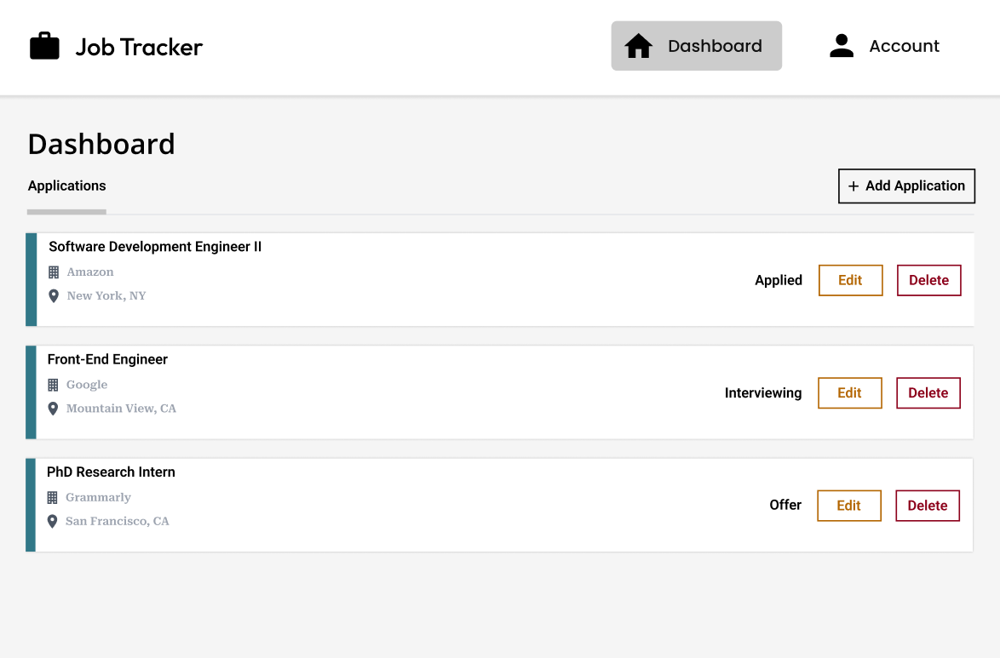

# Job Tracker

This is a job tracker application that allows registered users to track their job applications.

## Features

- Allow users to register or log in to their account
- Authenticate and authorize users with JSON Web Tokens
- Validate user data on both the client and server sides of the application
- Dynamically render a dashboard to display job applications
- API follows RESTful design architecture

## Technologies Used

- CSS
- ReactJS + Vite
- Python Django
- Django REST Framework
- Docker
- MySQL database

## Sign Up Page

## Dashboard

